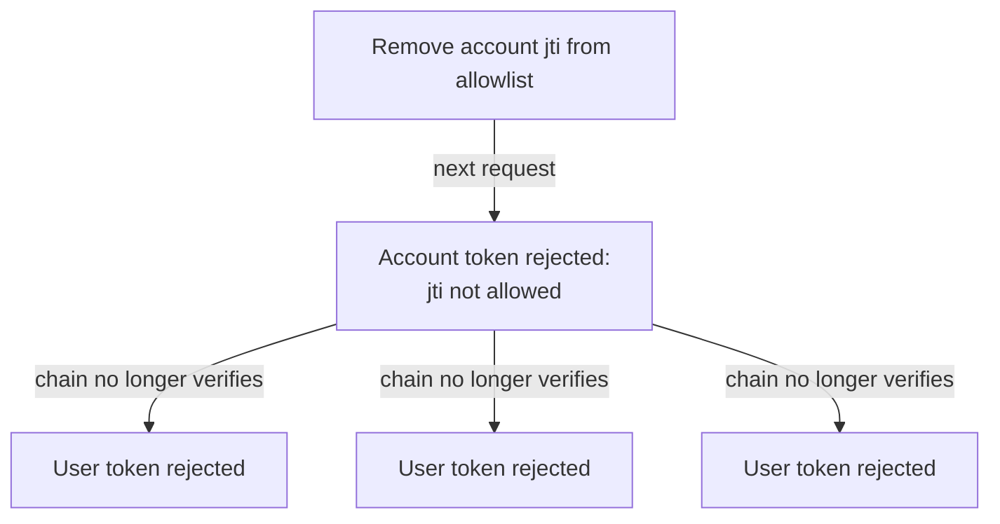

A token's validity window bounds how long it *can* live, but expiry alone
cannot revoke a credential early. Signatures verify offline, so there is no
issuer to phone and ask "is this still good?" The allowlist is how a server
answers that question locally.

## Fail closed

The rule is simple: an account token is accepted only if its `jti` is present in
the server's allowlist. A token that is not listed is rejected, even if its
signature is perfect and its expiry is far in the future. The allowlist is an
explicit set of ids the operator has deposited server-side, not a denylist of
revoked ones. Nothing is trusted by default.

```go
allowlist := valiss.NewStaticAllowlist(acmeAccountJTI, globexAccountJTI)
verifier := valiss.NewVerifier(operatorPub, allowlist)
```

Because account token ids are SHA-256 content hashes (see [Tokens](tokens.md)),
two distinct tokens yield the same id only with negligible probability, so one
allowlist can back several trust domains at once without practical ambiguity.

There is a development-only `valiss.AllowAll` that accepts every id. It exists
for local work where maintaining a list is friction you do not want yet. It
turns off revocation entirely; the token signature and expiry still gate access,
but nothing can be cut off early. Do not ship it.

## Revocation is removal

To revoke an account, remove its `jti` from the allowlist. The next request
carrying that account token is rejected. There is no propagation delay to a
remote service and no token to blacklist everywhere: the change is local to the
verifier's copy of the list, and `StaticAllowlist` supports replacing the whole
set atomically (for example after reloading a file) with `Set`.

```go
allowlist.Set(currentAccountIDs) // reload after an issuer change
```

On the issuer side, the valiss CLI (early development) is designed to keep the
allowlist as a first-class object alongside the tokens it mints, exporting the
exact file a server loads so deposits and revocations issue from the same place
as the tokens they gate. Those commands are stubs today, so for now the
allowlist file is hand-maintained: `examples/minter` prints each account
token's `jti`, and you add or remove that line yourself.

## The list is an interface

`StaticAllowlist` is a bundled implementation, not the model. The verifier
accepts anything satisfying the `Allowlist` interface, which is a single
method:

```go
type Allowlist interface {
	Allowed(jti string) bool
}
```

That one method is the whole contract, so where the ids come from is entirely
the implementation's business. A list loaded from a file and swapped with
`Set` is the simplest shape; the same interface can front a database query, a
cache refreshed from an internal service, or a fully dynamic policy decided
per call. The verifier consults it on every request, so whatever the
implementation returns is enforced immediately, with the same fail-closed
semantics: answer `false` and the token is rejected, no matter how valid its
signature.

## Revoking an account kills its users

The allowlist keys on account tokens, not user tokens, and that is deliberate.
Recall that a user token is only valid if its issuer is the `sub` of a valid,
allowlisted account token. When you remove an account's `jti`, the account token
stops verifying, so every user token that descends from it stops verifying too.
You revoke a tenant and its entire user population in one edit, without having to
enumerate the users, and without the users' own tokens needing to have expired.

One edit cascades to the whole user population:



This is the cryptographic counterpart to the "delegation cannot widen" property:
an account's authority flows down to its users through the chain, so cutting the
account cuts everything under it. It also means the allowlist stays small. You
list accounts, of which there are one per tenant, not users, of which there may
be many per tenant.

For mass revocation across a whole trust domain at once (re-keying, or
invalidating every token everywhere), the allowlist is the wrong tool; that is
what epoch [rotation](rotation.md) is for. The two levers are complementary:
the allowlist for selective, per-tenant revocation, epochs for domain-wide
rotation.

## Related

- [Rotation](rotation.md): the complementary lever, invalidating a whole trust
  domain at once instead of one tenant at a time.
