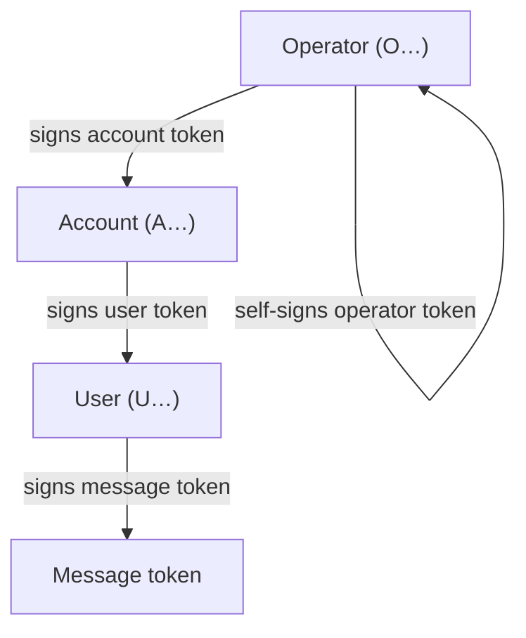

Every participant in valiss is an Ed25519 keypair. There are three delegation
levels, plus an optional fourth level that exists only per message:

1. **Operator.** The root of a trust domain. Its public key is the single
   value a server pins; everything else verifies against it. An operator signs
   account tokens.
2. **Account (tenant).** One per customer. The operator signs each account an
   *account token*. An account signs user tokens, so a tenant can mint its own
   users without asking you.
3. **User.** An end user or a service under an account. A user signs per-request
   proofs, and, if it needs to, per-message proofs.
4. **Message (optional).** A user key can additionally mint short-lived,
   self-signed proofs of origin for individual artifacts it emits (webhooks,
   queue messages, exported documents). Message tokens are proofs, never
   credentials: possessing one grants nothing, and a request verifier never
   accepts one.

The delegation only ever flows downward, and never widens: an account can grant
its users no more than it holds itself, and revoking an account cuts off
everything beneath it. That property is what lets you hand a customer one
account credential and stop thinking about how they subdivide it.

The signing chain, one operation per hop:



## Keys are nkeys

Identities are encoded in the NATS nkey text format: uppercase base32 of the
role prefix, the raw 32-byte public key, and a CRC-16 checksum. The important
consequence is that **the role is part of the key string**. Public keys and
seeds render with a recognizable leading letter:

| level    | seed prefix | public prefix |
| -------- | ----------- | ------------- |
| operator | `SO…`       | `O…`          |
| account  | `SA…`       | `A…`          |
| user     | `SU…`       | `U…`          |

Because the role travels with the key, a verifier can check at every hop of the
chain that an operator key signed the account token, an account key signed the
user token, and so on, from the key material alone. A whole class of
cross-level confusion (a user key masquerading as an account, say) cannot even
be expressed. The checksum also makes the encoding copy-paste-safe for the
places keys actually live: config files, environment variables, and CLI flags.
A corrupted key fails to parse rather than failing verification in some
confusing way later.

The public key is the on-wire identity. A subject proves possession of the
matching private key either per request (a request signature) or, for bearer
user tokens, by presenting the token alone.

## Names are labels, not identities

A token may carry a human-readable `name` (set with `valiss.WithName`), but the
name is issuer-asserted and is never checked for uniqueness at issuance. It is a
display label, not a key. When a token has no name, consumers show the subject's
public key in its place.

```go
acct, _ := valiss.IssueAccount(operator, tenantPub, valiss.WithName("acme"))
```

Uniqueness, where you need it, is the job of whatever collection holds several
entities side by side. If you segment tenant data by account name, it is on you
to keep those names distinct within your operator. Across different operators,
names may collide freely: two independent producers can each have a tenant
called `acme`, and you distinguish them by operator, not by name alone.
