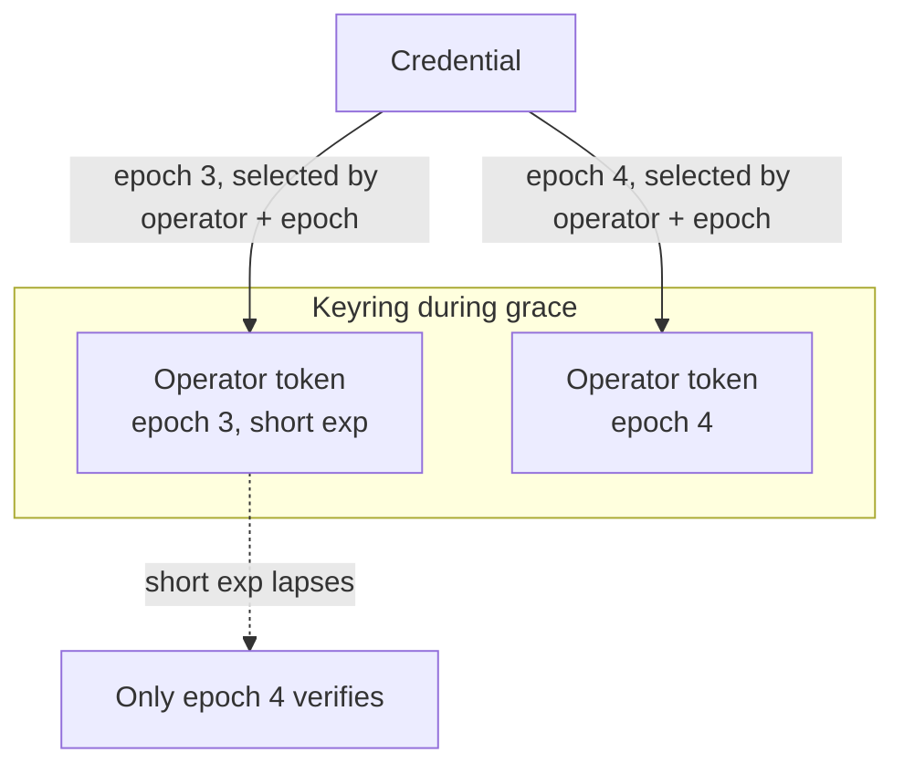

The [allowlist](allowlist.md) revokes one tenant at a time. Sometimes you need
the opposite: invalidate *everything* in a trust domain at once, because you are
re-keying, responding to a compromise, or enforcing a periodic re-issue.
Editing the allowlist tenant by tenant is the wrong tool for that. Epochs are
the right one.

## The operator token and the epoch counter

An operator can publish a self-signed **operator token**: a policy statement
about its own trust domain. It carries an **epoch** counter (a monotonically
advancing integer) and an optional validity window. When a verifier is
configured with an operator token, it accepts only account and user tokens
stamped with the operator's current epoch.

```go
opTok, _ := valiss.IssueOperator(operator,
    valiss.WithName("prod-us"), valiss.WithEpoch(3))
acct, _ := valiss.IssueAccount(operator, tenantPub,
    valiss.WithName("acme"), valiss.WithEpoch(3))

verifier := valiss.NewVerifier(operatorPub, allowlist,
    valiss.WithOperatorToken(opTok))
```

Every level in a chain must agree on the epoch. If the operator policy says
epoch 3, an account or user token stamped epoch 2 is rejected. The check is
cryptographic and needs no external state: the epoch is a signed claim, and the
verifier simply compares.

Two honesty notes. On the request path the epoch is enforced only when the
verifier holds an operator token or keyring; a bare
`NewVerifier(operatorPub, allowlist)` pins the anchor and checks the allowlist
but never compares epochs, so unstamped or stale-epoch credentials pass until
you configure a policy. Message verification has no such gap: `VerifyMessage`
always requires the chain's account, user, and message tokens to agree on their
epoch, and additionally binds them to the domain epoch when you supply an
operator policy.

## Rotating a whole domain at once

To rotate the trust domain, bump the operator's epoch and re-mint. Publish an
operator token at epoch 4, re-issue the account (and user) tokens at epoch 4,
and every token from an earlier epoch is rejected on its next use. No allowlist
edits, no per-tenant work, no waiting for old tokens to expire. One counter
advance retires the entire generation of credentials beneath it.

Driving this ceremony is issuer-side work. The valiss CLI (early development) is
designed to hold the operator identity in its per-operator store and roll it
forward with `operator rotate`, re-issuing beneath it rather than re-minting
each token by hand; that command is not yet runnable (a stub today). Until it
lands, the ceremony is the library issuance calls (`IssueOperator` at the new
epoch, then `IssueAccount`/`IssueUser` beneath it) or `examples/minter`.

The operator token's own `exp` bounds the whole domain: once it lapses, nothing
in the domain verifies until a fresh operator token is published, which forces a
periodic rotation ceremony rather than letting a domain drift indefinitely on
one key state.

Two things do **not** change during rotation. The pinned operator public key
stays the trust anchor; the operator token only carries policy signed by that
key, it does not replace it. And selective revocation stays with the allowlist.
The two levers are complementary: epochs for domain-wide rotation, the allowlist
for cutting off individual tenants.

## Grace periods with a keyring

A hard epoch flip assumes every producer can re-mint at the same instant. When
they cannot, a verifier can trust a **keyring** instead of a single operator
token. A keyring holds several full operator tokens, and one operator key may
appear at more than one epoch at the same time.

```go
k, _ := valiss.NewKeyring(prodUSEpoch3Token, prodUSEpoch4Token)
verifier := valiss.NewKeyringVerifier(k, allowlist)
```

Registering both the outgoing and the incoming epoch side by side is the
receiver-side **grace period**: producers re-mint at their own pace, and both
epochs verify meanwhile. You bound the window by giving the transitional
old-epoch operator token a short `exp`, which closes the grace cryptographically
when it lapses. Entries are selected by the operator named in the credential
rather than by trial, so an unknown operator, or a known operator at an
unregistered epoch, fails immediately.

Both epochs verify while the outgoing operator token is unexpired; its `exp`
closes the grace:



The same keyring also lets one verifier trust several independent operators at
once; a handler reads the trust domain from `id.Operator`, and the keyring
guarantees a name maps to exactly one operator key.

## Related

- [Extensions](extensions.md): the typed, signed authorization claims the
  transports enforce down the chain.
